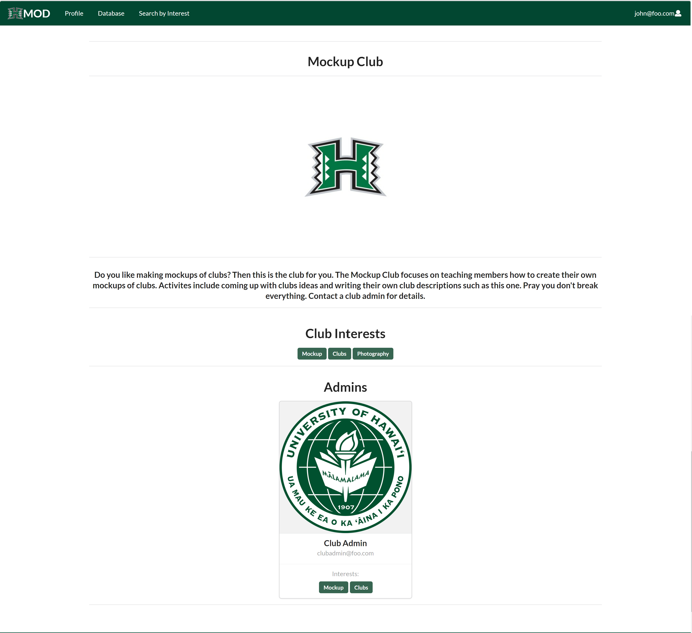

# Manoa Organization Database


## Github Repository
[Repository Link](https://github.com/manoa-organization-database/manoa-organization-database)

## Table of contents

* [Overview](#overview)
* [Installation](#installation)
* [Walkthrough](#walkthrough)
* [Deployment](#deployment)
* [Milestones](#milestones)
* [Team](#team)

## Overview

The Manoa Organization Database (MOD) is a web application that functions as a catalog for the various student clubs operating in UH Manoa. Club leaders are able to provide information about their clubs such as descriptions, meeting times and locations, contact information, among others. Students can search for clubs according to their interests, as well as being notified when a club matching their interests is created. 

## Installation

First, [install Meteor](https://www.meteor.com/install).

Second, [download a copy of the application](https://github.com/manoa-organization-database/manoa-organization-database).

Third, once you have the copy downloaded, cd into the app directory and install the required libraries with:

```
$ meteor npm install
```

Once you have installed the libraries, you can run the application with the following command:

```
$ meteor npm run start
```

The first time you run the app, it will create some default users and data. Here is the output:

```
meteor npm run start

> manoa-organization-database@ start C:\Users\user\github\manoa-organization-database\app
> meteor --no-release-check --exclude-archs web.browser.legacy,web.cordova --settings ../config/settings.development.json

[[[[[ C:\Users\user\github\manoa-organization-database\app ]]]]]

=> Started proxy.
=> Started MongoDB.
I20220426-11:00:22.265(-10)? Creating roles: user, club-admin, admin
I20220426-11:00:22.367(-10)? Creating the default profiles
I20220426-11:00:22.368(-10)? Defining profile john@foo.com
I20220426-11:00:22.436(-10)? Defining profile admin@foo.com
I20220426-11:00:22.562(-10)? Defining profile clubadmin@foo.com
I20220426-11:00:22.707(-10)? Creating the default clubs
I20220426-11:00:22.708(-10)? Defining club Mockup Club
I20220426-11:00:22.744(-10)? Defining club Photography Club
I20220426-11:00:22.759(-10)? Defining club Sports Club
I20220426-11:00:22.817(-10)? Monti APM: completed instrumenting the app
=> Started your app.

=> App running at: http://localhost:3000/
   Type Control-C twice to stop.   
```

If all goes well, the template application will appear at [http://localhost:3000](http://localhost:3000).  You can login using the credentials in [settings.development.json](https://github.com/manoa-organization-database/manoa-organization-database/blob/master/config/settings.development.json), or else register a new account.

Lastly, you can run ESLint over the code in the imports/ directory with:

```
meteor npm run lint
```

## Walkthrough

### Landing Page

When you start the application, you are taken to the landing page that contains a brief introduction to the features of the Manoa Organization Database:


### Sign Up Page

If you do not already have an account, then you can click "Login" and "Sign Up" to register for a new account:


A new account requires your full name, your email, your UH id number, and an image link.

### Sign In Page

To sign into your account, click "Login" and then "Sign In" to open the Sign In page:


There are three types of users: A regular user, a site admin, and a club admin. Each role can access different features of the application.

#### User profile Page

Once logged in, the application will take you to the profile page:


The page lists your name, email picture, clubs, and interests. If you're a club admin, you also get a section for the clubs you are an admin for:


Clicking the edit button will take you to a form that lets you edit your profile:


Here you can update your name, picture, interests, and clubs.

### Club Database Page

Clicking on the Database Link will take you to a page where you can view the clubs in the database:


### Interest Search Page

Clicking on the Search by Interest Link will take you to a page where you can filter the clubs in the database by one or more interests:


Warning: The page will display all clubs that match any of the interests, even if it only matches one.

### Club Page

Clicking on either the club card on the database and interest search pages or the club button on your profile will take you to the appropiate club page:



Here you can see the club name, description, picture, interests, and admins.

### Admin Club Page

For club admins, clicking on a club in the admin section of the profile takes you to the admin club page:


This page is similar to the normal club page, with a button that takes you a form to edit the club page:


Club admins can edit the club description, picture, and interests.

### User Status Page

If the user is a site admin, they can click the Change User Status link to assign a user a role of user, club admin, or site admin and assign them to clubs:


### Interest Page

Admins can click the Edit Interests link to access the interests page, where they can add new interests or delete old ones:


## Deployment
[Digital Ocean deployed application](https://manoa-organization-database.xyz/)

Feel free to take a few minutes to fill out our [feedback form](https://docs.google.com/forms/d/e/1FAIpQLSdkIA7rCYJ7TqpH37BMauF7ttJusqyDOsFZYdJTDTCLRt0TcQ/viewform) to help us improve our site.

## Milestones
* [M1](https://github.com/manoa-organization-database/manoa-organization-database/projects/1)
* [M2](https://github.com/manoa-organization-database/manoa-organization-database/projects/3)
* [M3](https://github.com/manoa-organization-database/manoa-organization-database/projects/4)

## Team
[Signed team contract (Google Docs)](https://docs.google.com/document/d/1UChPYIE-sgugvcdFsXJEnXW9ANwPD44ScJRYUDkU3s4/edit?usp=sharing)

Project Members:
* Michael Jake Sumaylo
  * [https://msumaylo.github.io/](https://msumaylo.github.io/) 
* Cacie Sonomura
  * [https://caciems.github.io/](https://caciems.github.io/)
* Cameron Sumida
  * [https://sumidaca.github.io/](https://sumidaca.github.io/)
* Justin Jandoc
  * [https://justinjandoc.github.io/](https://justinjandoc.github.io/)
* Jeremiah Dy
  * [https://jeremiah-dy.github.io/](https://jeremiah-dy.github.io/)
