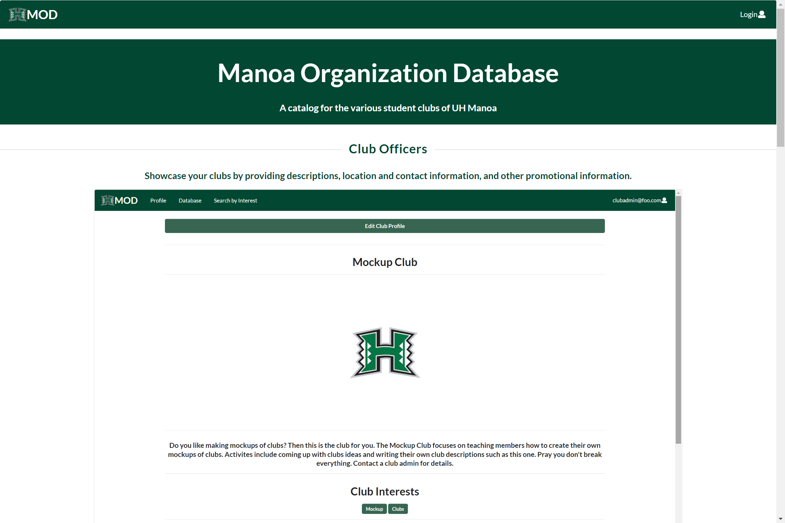
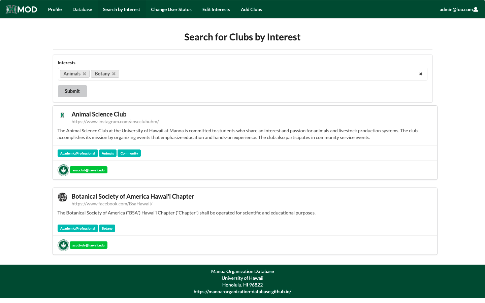

# Manoa Organization Database


## Github Repository
[Repository Link](https://github.com/manoa-organization-database/manoa-organization-database)

## Table of contents

* [Overview](#overview)
* [Installation](#installation)
* [Walkthrough](#walkthrough)
* [Community Feedback](#community-feedback)
* [Deployment](#deployment)
* [Milestones](#milestones)
* [Team](#team)

## Overview

The Manoa Organization Database (MOD) is a web application that functions as a catalog for the various student clubs operating in UH Manoa. Club leaders are able to provide information about their clubs such as descriptions, meeting times and locations, contact information, among others. Students can search for clubs according to their interests, as well as being notified when a club matching their interests is created. 

## Installation

First, [install Meteor](https://www.meteor.com/install).

Second, [download a copy of the application](https://github.com/manoa-organization-database/manoa-organization-database).

Third, once you have the copy downloaded, cd into the app directory and install the required libraries with:

```
$ meteor npm install
```

Once you have installed the libraries, you can run the application with the following command:

```
$ meteor npm run start
```

The first time you run the app, it will create some default users and data. Here is the output:

```
meteor npm run start

> manoa-organization-database@ start C:\Users\user\github\manoa-organization-database\app
> meteor --no-release-check --exclude-archs web.browser.legacy,web.cordova --settings ../config/settings.development.json

[[[[[ C:\Users\user\github\manoa-organization-database\app ]]]]]

=> Started proxy.
=> Started MongoDB.
I20220510-10:35:19.539(-10)? Creating roles: user, club-admin, admin
I20220510-10:35:19.623(-10)? Loading data from private/data.json
I20220510-10:35:19.623(-10)? Creating the default profiles
I20220510-10:35:19.623(-10)? Defining profile john@foo.com
I20220510-10:35:20.077(-10)? Defining profile admin@foo.com
I20220510-10:35:20.188(-10)? Defining profile clubadmin@foo.com
I20220510-10:35:20.376(-10)? Defining profile acctclub@hawaii.edu
I20220510-10:35:20.519(-10)? Defining profile aecthi@hawaii.edu
I20220510-10:35:20.635(-10)? Defining profile halliday@hawaii.edu
I20220510-10:35:20.766(-10)? Defining profile brucew@hawaii.edu
I20220510-10:35:20.885(-10)? Defining profile alohadm@hawaii.edu
I20220510-10:35:20.999(-10)? Defining profile amterrel@hawaii.edu
I20220510-10:35:21.114(-10)? Defining profile dharv200@hawaii.edu
I20220510-10:35:21.224(-10)? Defining profile cgoo24@hawaii.edu
I20220510-10:35:21.331(-10)? Defining profile aauw.uhmanoa@gmail.com
I20220510-10:35:21.444(-10)? Defining profile asce808@gmail.com
I20220510-10:35:21.588(-10)? Defining profile anakbayanhawaii@gmail.com
I20220510-10:35:21.699(-10)? Defining profile anscclub@hawaii.edu
I20220510-10:35:21.815(-10)? Defining profile ausa@hawaii.edu
I20220510-10:35:21.929(-10)? Defining profile aias@hawaii.edu
I20220510-10:35:22.039(-10)? Defining profile amauhm@gmail.com
I20220510-10:35:22.146(-10)? Defining profile ams@hawaii.edu
I20220510-10:35:22.257(-10)? Defining profile bwso@hawaii.edu
I20220510-10:35:22.365(-10)? Defining profile bcmoahu@gmail.com
I20220510-10:35:22.475(-10)? Defining profile nrbkang@hawaii.edu
I20220510-10:35:22.582(-10)? Defining profile bap@hawaii.edu
I20220510-10:35:22.688(-10)? Defining profile scottvdv@hawaii.edu
I20220510-10:35:22.794(-10)? Defining profile secretary.bestuhm@gmail.com
I20220510-10:35:22.904(-10)? Defining profile Chemclub@hawaii.edu
I20220510-10:35:23.016(-10)? Defining profile cki@hawaii.edu
I20220510-10:35:23.131(-10)? Defining profile cmaa.uhmanoa@gmail.com
I20220510-10:35:23.238(-10)? Defining profile copalakaina@gmail.com
I20220510-10:35:23.343(-10)? Defining profile disneyoc@hawaii.edu
I20220510-10:35:23.455(-10)? Defining profile uhdronetechnology@gmail.com
I20220510-10:35:23.564(-10)? Defining profile ewtm@hawaii.edu
I20220510-10:35:23.670(-10)? Defining profile ecouncil@hawaii.edu
I20220510-10:35:23.771(-10)? Defining profile emaatuhm@gmail.com
I20220510-10:35:23.882(-10)? Defining profile uh.hkn.do@gmail.com
I20220510-10:35:23.990(-10)? Defining profile uhfmig@gmail.com
I20220510-10:35:24.099(-10)? Defining profile teryn21@hawaii.edu
I20220510-10:35:24.209(-10)? Defining profile fshnnews@hawaii.edu
I20220510-10:35:24.314(-10)? Defining profile uhmfsae@gmail.com
I20220510-10:35:24.423(-10)? Defining profile ocornejo@hawaii.edu
I20220510-10:35:24.533(-10)? Defining profile gradhui@hawaii.edu
I20220510-10:35:24.644(-10)? Defining profile gbsa@hawaii.edu
I20220510-10:35:24.793(-10)? Defining profile greyhats@hawaii.edu
I20220510-10:35:24.906(-10)? Defining profile manoapgm@hawaii.edu
I20220510-10:35:25.012(-10)? Defining profile boomla@hawaii.edu
I20220510-10:35:25.121(-10)? Defining profile omsshui@hawaii.edu
I20220510-10:35:25.227(-10)? Defining profile masonRusso
I20220510-10:35:25.344(-10)? Defining profile hosauhm@hawaii.edu
I20220510-10:35:25.453(-10)? Defining profile sswgso@hawaii.edu
I20220510-10:35:25.560(-10)? Defining profile olapono@hawaii.edu
I20220510-10:35:25.663(-10)? Creating the default clubs
I20220510-10:35:25.664(-10)? Defining club Mockup Club
I20220510-10:35:25.929(-10)? Defining club Accounting Club
I20220510-10:35:25.938(-10)? Defining club AECT - Hawaii
I20220510-10:35:25.953(-10)? Defining club Aikido at UHM
I20220510-10:35:25.968(-10)? Defining club AINAMOANA PHILOSOPHIES ORGANIZATION (APO) at the University of Hawai’i at Mānoa
I20220510-10:35:25.983(-10)? Defining club Alohathon Dance Marathon
I20220510-10:35:26.002(-10)? Defining club Alpha Gamma Delta Delta Sigma Chapter
I20220510-10:35:26.006(-10)? Defining club Alpha Sigma Phi
I20220510-10:35:26.021(-10)? Defining club Alpha Omega Hawaii
I20220510-10:35:26.038(-10)? Defining club AMA/HMA Student Chapter at JABSOM
I20220510-10:35:26.048(-10)? Defining club American Association of University Women at UH Manoa
I20220510-10:35:26.065(-10)? Defining club American Society of Civil Engineers
I20220510-10:35:26.083(-10)? Defining club Anakbayan Hawaii
I20220510-10:35:26.094(-10)? Defining club Animal Science Club
I20220510-10:35:26.111(-10)? Defining club Anthropology Undergraduate Student Association
I20220510-10:35:26.128(-10)? Defining club American Institute of Architecture Students - Hawaii Chapter
I20220510-10:35:26.145(-10)? Defining club American Marketing Association at University of Hawaii at Manoa
I20220510-10:35:26.167(-10)? Defining club Anime Manga Society of Hawaii @ UH Manoa
I20220510-10:35:26.175(-10)? Defining club Associated Students of the John A. Burns School of Medicine
I20220510-10:35:26.190(-10)? Defining club Bachelor of Social Work Organization
I20220510-10:35:26.212(-10)? Defining club Ballroom Dance Club at UH
I20220510-10:35:26.222(-10)? Defining club Baptist Collegiate Ministries O'ahu
I20220510-10:35:26.250(-10)? Defining club Bedroom Artists and Musicians at the University of Hawaii at Manoa
I20220510-10:35:26.261(-10)? Defining club Beta Alpha Psi - Delta Theta Chapter
I20220510-10:35:26.275(-10)? Defining club Beta Beta Gamma
I20220510-10:35:26.287(-10)? Defining club Botanical Society of America Hawai'i Chapter
I20220510-10:35:26.304(-10)? Defining club Business Executive Society of Tomorrow
I20220510-10:35:26.319(-10)? Defining club Chemistry Club at UH Manoa
I20220510-10:35:26.328(-10)? Defining club Chi Epsilon at UHM
I20220510-10:35:26.342(-10)? Defining club Circle K International
I20220510-10:35:26.366(-10)? Defining club Class of 2024 at JABSOM
I20220510-10:35:26.379(-10)? Defining club Class of 2025 at JABSOM
I20220510-10:35:26.391(-10)? Defining club Club Management Association of America
I20220510-10:35:26.410(-10)? Defining club Coalition to Stop Campus Hunger
I20220510-10:35:26.422(-10)? Defining club C.O.P. Alaka'ina
I20220510-10:35:26.436(-10)? Defining club CTAHR Student Ambassadors
I20220510-10:35:26.447(-10)? Defining club Delta Sigma Pi: Rho Chi
I20220510-10:35:26.453(-10)? Defining club Disney Ohana Club
I20220510-10:35:26.462(-10)? Defining club Drone Technologies at the University of Hawaii
I20220510-10:35:26.475(-10)? Defining club East-West Toastmasters
I20220510-10:35:26.492(-10)? Defining club Engineers' Council at the University of Hawaii
I20220510-10:35:26.503(-10)? Defining club English Majors Association
I20220510-10:35:26.524(-10)? Defining club Eta Kappa Nu
I20220510-10:35:26.543(-10)? Defining club Every Nation Campus at the University of Hawaii at Manoa
I20220510-10:35:26.570(-10)? Defining club Ēwe ‘Ula
I20220510-10:35:26.606(-10)? Defining club Family Medicine Interest Group
I20220510-10:35:26.627(-10)? Defining club Financial Management Association
I20220510-10:35:26.645(-10)? Defining club Food Science and Human Nutrition Council
I20220510-10:35:26.668(-10)? Defining club Formula SAE Rainbow Warrior Racing
I20220510-10:35:26.680(-10)? Defining club Generation Action at the University of Hawaii at Manoa
I20220510-10:35:26.711(-10)? Defining club Graduate Hui Ola Pono
I20220510-10:35:26.736(-10)? Defining club Graduate Business Student Association
I20220510-10:35:26.759(-10)? Defining club Grey Hats at UHM
I20220510-10:35:26.788(-10)? Defining club Hawaii Alpha Chapter of Pi Gamma Mu
I20220510-10:35:26.798(-10)? Defining club Hawaii Chapter of the Society for Conservation Biology
I20220510-10:35:26.813(-10)? Defining club Hawaii Streams and Ecosystems
I20220510-10:35:26.828(-10)? Defining club Hawaii Student Entrepreneurs
I20220510-10:35:26.862(-10)? Defining club Hawaii Undergraduate Initiative
I20220510-10:35:26.881(-10)? Defining club Hillel Hawaii
I20220510-10:35:26.891(-10)? Defining club HOSA at UHM
I20220510-10:35:26.910(-10)? Defining club Hui Kākoʻo: Department of Social Work Graduate Student Organization 
I20220510-10:35:26.927(-10)? Defining club Hui Ola Pono
I20220510-10:35:27.313(-10)? Monti APM: completed instrumenting the app
=> Started your app.

=> App running at: http://localhost:3000/
   Type Control-C twice to stop.   
```

If all goes well, the template application will appear at [http://localhost:3000](http://localhost:3000).  You can login using the credentials in [settings.development.json](https://github.com/manoa-organization-database/manoa-organization-database/blob/master/config/settings.development.json), or else register a new account.

Lastly, you can run ESLint over the code in the imports/ directory with:

```
meteor npm run lint
```

## Walkthrough

### Landing Page

When you start the application, you are taken to the landing page that contains a brief introduction to the features of the Manoa Organization Database:



### Sign Up Page

If you do not already have an account, then you can click "Login" and "Sign Up" to register for a new account:


A new account requires your full name, your email, your UH id number, and an image link.

### Sign In Page

To sign into your account, click "Login" and then "Sign In" to open the Sign In page:


There are three types of users: A regular user, a site admin, and a club admin. Each role can access different features of the application.

#### User profile Page

Once logged in, the application will take you to the profile page:


The page lists your name, email picture, clubs, and interests. If you're a club admin, you also get a section for the clubs you are an admin for:


Clicking the edit button will take you to a form that lets you edit your profile:


Here you can update your name, picture, interests, and clubs.

### Club Database Page

Clicking on the Database Link will take you to a page where you can view the clubs in the database:


### Interest Search Page

Clicking on the Search by Interest Link will take you to a page where you can filter the clubs in the database by one or more interests:



Warning: The page will display all clubs that match any of the interests, even if it only matches one.

### Club Page

Clicking on either the club card on the database and interest search pages or the club button on your profile will take you to the appropiate club page:


Here you can see the club name, description, picture, interests, and admins.

### Admin Club Page

For club admins, clicking on a club in the admin section of the profile takes you to the admin club page:


This page is similar to the normal club page, with a button that takes you a form to edit the club page:


Club admins can edit the club description, picture, and interests.

### User Status Page

If the user is a site admin, they can click the Change User Status link to assign a user a role of user, club admin, or site admin and assign them to clubs:


### Interest Page

Admins can click the Edit Interests link to access the interests page, where they can add new interests or delete old ones:


## Community Feedback
Feel free to take a few minutes to fill out our [feedback form](https://docs.google.com/forms/d/e/1FAIpQLSdkIA7rCYJ7TqpH37BMauF7ttJusqyDOsFZYdJTDTCLRt0TcQ/viewform) to help us improve our site.

### Kylie T.
* Expected interests and clubs to be alphabetically sorted in all forms (search, add club, etc.) *fixed*
* Should be able to filter interests in "Search by Interest" by typing too *fixed*
* Personal preference, but I think that the format for you "cards" should be more compact, so you can fit more information in less space.
* Would really appreciate a "back-to-top" button

### Jonah B.
* Registering users should have an email verification to prevent account theft.
* Does not allow users to create personalized interests. Lacks customization and individualidity.
* Some buttons (such as email labels) are not interactable. Making these interactable would improve user functionality and reduce the number of "clicks" this site requires to function.
* A "back-to-top" function is really needed. The site becomes annoying to scroll through after a while.
* Filtering interests by "and" rather than "or" would be more useful. For example, if I put "Animals" and "Leisure", I want to be able to find only the clubs that have "Animals" and "Leisure".
* Character limits for certain fields (name fields most important!). I could fit the entire Bee movie script as my name and it went through.

### Ashley G.
* The regular club "database" page is kinda useless. Feels like most people will use the "search by interest" page instead.
* Should be able to search by typing in interests, not just by selecting from a dropdown. *fixed*
* Functional (if a little bland) in appearance, does its job and nothing more.

### John D.
* I felt that the sign-up screen was what I expected it would look like. A little bland but simple and easy to use.
* Be able to add working links to the club page description.
As with other users, this user noted that:
* perhaps implementing a search feature to the "interests" dropdown for convenience instead of only being able to scroll down a list of "interests" to find certain "interest". *fixed*
* scrolling through a list of all the clubs and their descriptions may feel overwhelming and tedious. feels like people are just gonna use the "search by interest option" to find clubs instead.

### Jane D.
* Include info icon next to interests and clubs to remind users what it could be used for (on the profile/edit profile pages).
* "Search by interest" tab should be a search bar included in the database tab. 

## Deployment
[Digital Ocean deployed application](https://manoa-organization-database.xyz/)

## Milestones
* [M1](https://github.com/manoa-organization-database/manoa-organization-database/projects/1)
* [M2](https://github.com/manoa-organization-database/manoa-organization-database/projects/3)
* [M3](https://github.com/manoa-organization-database/manoa-organization-database/projects/4)

## Team
[Signed team contract (Google Docs)](https://docs.google.com/document/d/1UChPYIE-sgugvcdFsXJEnXW9ANwPD44ScJRYUDkU3s4/edit?usp=sharing)

Project Members:
* Michael Jake Sumaylo
  * [https://msumaylo.github.io/](https://msumaylo.github.io/) 
* Cacie Sonomura
  * [https://caciems.github.io/](https://caciems.github.io/)
* Cameron Sumida
  * [https://sumidaca.github.io/](https://sumidaca.github.io/)
* Justin Jandoc
  * [https://justinjandoc.github.io/](https://justinjandoc.github.io/)
* Jeremiah Dy
  * [https://jeremiah-dy.github.io/](https://jeremiah-dy.github.io/)
