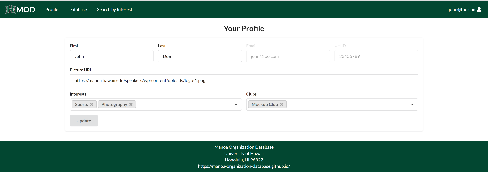

# Manoa Organization Database

## Github Repository
[Repository Link](https://github.com/manoa-organization-database/manoa-organization-database)

## Table of contents

* [Overview](#overview)
* [Mockups](#mockups)
* [Deployment](#deployment)
* [Milestones](#milestones)
* [Team](#team)

## Overview

The Manoa Organization Database (MOD) is a web application that functions as a catalog for the various student clubs operating in UH Manoa. Club leaders are able to provide information about their clubs such as descriptions, meeting times and locations, contact information, among others. Students can search for clubs according to their interests, as well as being notified when a club matching their interests is created. 

## Mockups

### Landing Page

### User Profile

### Edit User Profile

### Club Home Page

### Filter Interests Page

### Change User Status (ADMIN ONLY)

## Deployment
[Digital Ocean deployed application](http://157.230.5.143/)

## Milestones
* [M1](https://github.com/manoa-organization-database/manoa-organization-database/projects/1)
* [M2](https://github.com/manoa-organization-database/manoa-organization-database/projects/3)

## Team
[Signed team contract (Google Docs)](https://docs.google.com/document/d/1UChPYIE-sgugvcdFsXJEnXW9ANwPD44ScJRYUDkU3s4/edit?usp=sharing)

Project Members:
* Michael Jake Sumaylo
  * [https://msumaylo.github.io/](https://msumaylo.github.io/) 
* Cacie Sonomura
  * [https://caciems.github.io/](https://caciems.github.io/)
* Cameron Sumida
  * [https://sumidaca.github.io/](https://sumidaca.github.io/)
* Justin Jandoc
  * [https://justinjandoc.github.io/](https://justinjandoc.github.io/)
* Jeremiah Dy
  * [https://jeremiah-dy.github.io/](https://jeremiah-dy.github.io/)
